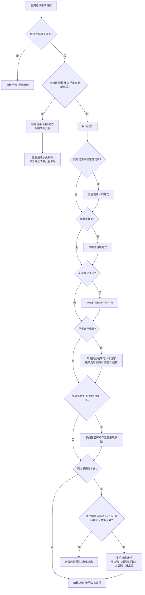
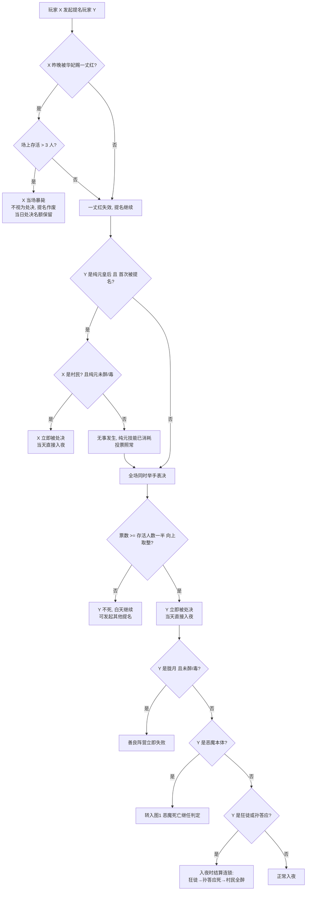
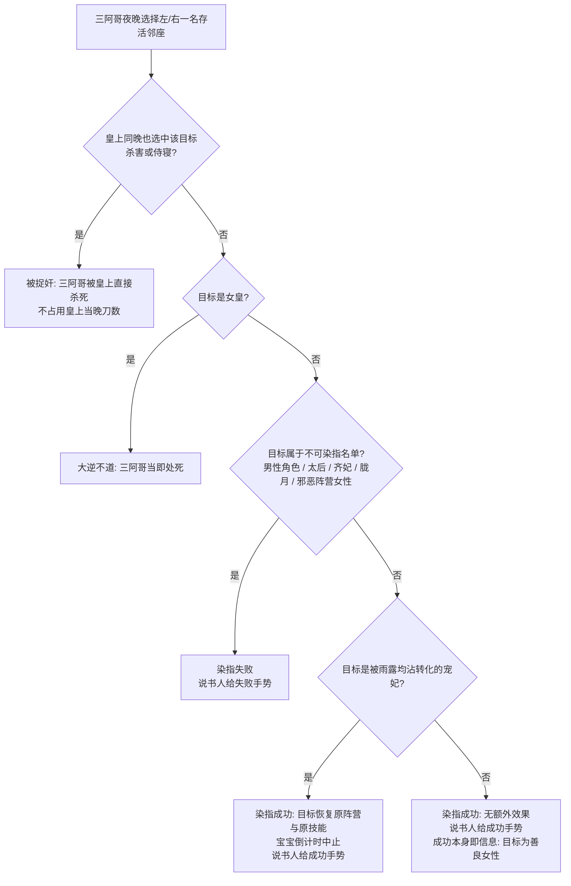
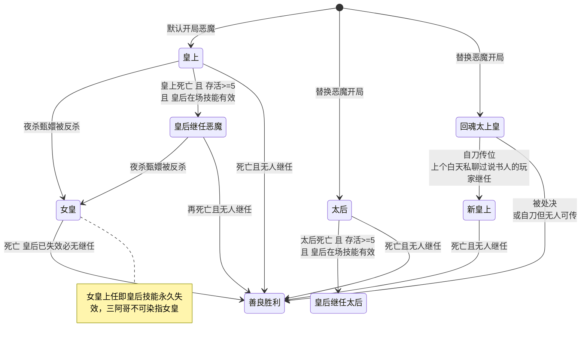
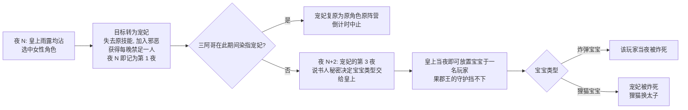

# 血战甄嬛传 —— 说书人决策图

配合 [rules.md](rules.md) 使用。所有图均为**建议裁定**，说书人拥有最终裁量权。

---

## 1. 夜晚死亡结算总流程

恶魔（皇上/女皇/皇后/太后/太上皇）出刀后的完整结算链：

---

## 2. 白天提名与处决流程

被齐妃禁言者违规说话、狂徒身份暴露，同样走"直接处决"→ 从节点 M 进入后续判定。

---

## 3. 三阿哥染指决策树

> 信息价值提示：失败手势 = 目标是男性/太后/齐妃/胧月/邪恶女性之一；成功手势 = 目标是女性且属善良阵营。"女性爪牙"按**阵营**判定——对食转为邪恶的槿汐给失败手势。说书人应意识到三阿哥是隐藏的验人位。

---

## 4. 恶魔权力更替状态图

---

## 5. 宠妃与宝宝时间线

> 首夜转化 → 夜 3 就能引爆。宠妃死亡期间不计数（"存在三个夜晚"按存活的夜晚算）。

---

## 6. 醉酒与中毒来源一览

| 来源 | 目标限制 | 时限 | 是否公开 |
|---|---|---|---|
| 敦亲王把酒言欢 | 任意玩家，白天公开点名 | 一天一夜 | 公开 |
| 安陵容香粉下毒 | 仅女性角色 | 至下一个黄昏 | 隐蔽 |
| 浣碧邻座果郡王 | 浣碧本人 | 相邻期间持续 | 隐蔽 |
| 孙答应死亡 | 全体村民 | 一天一夜 | 隐蔽（说书人备注，不公告） |
| 温实初解状态 | 可解除上述任意状态（浣碧的座位醉酒除外） | — | 隐蔽 |

结算优先级：温实初排在**安陵容之后、果郡王之前**，"解除"在这个位置生效——只能解除**当时已存在**的状态（今夜安陵容刚下的毒来得及解，白天敦亲王灌的酒也解得掉），而解除之后该玩家当晚**后续**的技能按已恢复结算（守护、槿汐、小允子、三阿哥、华妃都在其后）。之后新施加的醉/毒照常生效。

浣碧因邻座果郡王而醉酒是座位效应，解不掉——工具会在情报里注明。

---

## 7. 随机与信息可见性策略（两种模式同一分布）

说书人模式的「🎲 随机」按钮与无说书人模式的机器人说书人遵循**完全相同**的策略；未在此列出的自由裁量点，默认在合法选项中均匀随机。

**随机策略**

| 决定 | 策略 |
|---|---|
| 一切随机选人 | **不选死者**（给死人发情报/浪费技能是白给）；主动手动选择死者仍然合法，照常落空 |
| 安陵容·情报对象 | 额外排除**邪恶阵营**（自己人身份不算情报），且**不重复**——已告知过的不再进池；合格者全部告知过后回到真随机（仅仍排除死者），并给说书人一条备注说明缘由 |
| 玉娆·首夜绑定 | 在善良玩家中随机（选项本身已限定善良），排除死者 |
| 太后双选死几人 | 均匀随机（说书人模式可自行裁量；机器人在 0/1/2 的合法选项中均匀随机） |
| 宝宝类型 | 均匀随机（炸弹/狸猫各半） |
| 属于玩家自己的决定 | **永不随机**：年羹尧带人、温实初解不解、太上皇传位——说书人模式代录玩家口述，无说书人模式转交该玩家自己选 |
| 狂徒被捉奸 | 机器人**不掷**这枚骰子：无说书人模式仅由狂徒自曝（见 rules.md 狂徒条目） |

**信息可见性**

- **说书人备注一律保密**：技能落空、醉/毒判定、皇后继任、孙答应醉酒波及面等结算细节只进说书人备忘/隐藏日志；玩家该听到的必须是引擎显式发出的公开事件。
- 醉/毒玩家的信息包由说书人（或机器人）**编造假信息**后送达，不告知本人。
- 说书人拥有全知视图（含各座位身份、状态与预掷的随机结果，预掷结果确认前可改）；玩家视图在两种模式下一致。
- 祺贵人检举：公开事件只播报**检举宣言本身**（谁检举谁是什么身份）；猜对/猜错的结果不当场公告，由当夜死亡自行揭晓——否则醉/毒时的"无事发生"会当场暴露其状态。

---

## 8. 特殊胜负条件清单

| 条件 | 结果 |
|---|---|
| 恶魔死亡且无人继任 | 善良胜 |
| 存活仅剩 2 人且恶魔在场 | 邪恶胜 |
| 胧月被处决（未醉/毒） | 胧月所在阵营（善良）败 |
| 全部善良玩家死亡 | 邪恶胜 |
| 女皇死亡 | 善良胜（皇后必已失效） |

> 说书人注意：狂徒→孙答应→全村民醉酒的连锁、以及叶澜依复活，都可能在濒临终局时逆转局势，宣布胜负前先结算完整连锁。
